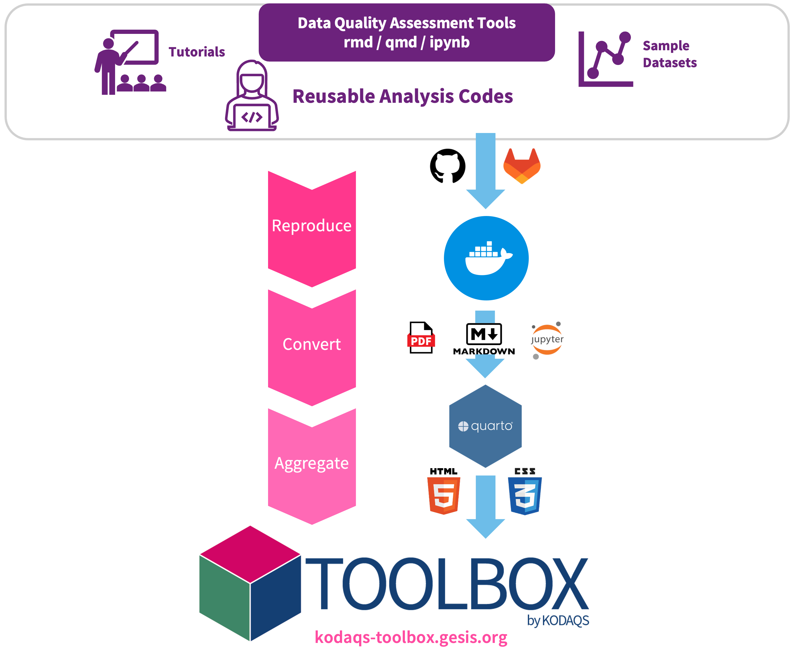

# kodaqs-toolbox.gesis.org 

This repository contains the code for building the KODAQS Data Quality Toolbox website [kodaqs-toolbox.gesis.org](https://kodaqs-toolbox.gesis.org).

Based on the R package [`andrew`](https://github.com/GESIS-Methods-Hub/andrew) (Aggregator for Navigatable Discoverable Reproducible and Educational work), reusable tools in the form of literate programming documents such as [R Markdown](https://rmarkdown.rstudio.com/), [Quarto Documents](https://quarto.org/docs/get-started/hello/rstudio.html), and [Jupyter Notebooks](https://nbformat.readthedocs.io/) are collected from different repositories, reproduced in [containers](https://en.wikipedia.org/wiki/OS-level_virtualization), and compiled into a single static website.
In our KODAQS Toolbox, we focus on tools and resources related to data quality. However, the approach is generic and can be applied to other domains as well.

Below is the workflow of the building process.




## Dependencies

- [Docker](https://www.docker.com/)
- Quarto >= 1.3
- Dependencies specified in [`env.yaml`](./env.yaml)

### Dependencies installation

For Docker, follow the steps in [https://docs.docker.com/engine/install/](https://docs.docker.com/engine/install/).
Note that Docker must be configured to be able to run without superuser privileges.
You can achieve this by either:

- rootless Docker installation (https://docs.docker.com/engine/security/rootless/)
- or: add your user to the `docker` group (https://docs.docker.com/engine/install/linux-postinstall/)

For Quarto, download the latest release from https://github.com/quarto-dev/quarto-cli/releases.

Except for Docker and Quarto, all the dependencies can be installed with `mamba` or `conda`.
Install `micromamba` following the [Mamba Documentation](https://mamba.readthedocs.io/en/latest/installation/micromamba-installation.html) and create the environment specified in `env.yaml`:

```bash
micromamba create -y -n andrew -f env.yaml
```


## How to build the website

Make sure the environment `andrew` is activated, for example:

```bash
micromamba activate andrew
```

To build the KODAQS Toolbox website as a demo, run the following command in the root directory of the repository:

```bash
Rscript start.R
```

Then, render the website with Quarto:

```bash
./render.sh
```

The static website will be generated in the `demo/_site/` folder.

## Developer notes

The file `main.R` is the entrypoint for the pipeline. It consists of the following steps:

- downloading (cloning the repositories) in `download_contributions.R`. They will be stored in the repository names without underscore.
- compiling the contributions to markdown and removing all dynamic elements (should be static md afterwards). This is done in `render_contributions.R`.
  1. create a docker container depending on the needs (python, R, etc.)
  2. run compilation scripts in the container (`inst/docker-scripts`) to map the different repository types and entry points
  3. copy/using valumes to move the resulting static markdown to the repositories with underscore.
- automatically create a quarto structure for composing the different repositories into one website

### Using a minimal example for debugging

In the directory `minimal_example/` there is a pipeline to build only one tool to test the process. It does not fulfill all the requirements of the main pipeline but it is a faster way of testing new tool integration.
The corresponding scripts are `start_minimal.R` and `render_minimal.sh`.

## Deployment

- `deploy.sh` deploys the rendered website to `/var/www/html/`. (NOTE: all content in `/var/www/html/` will be deleted before deployment!)

## Customization

Edit the entries in the following files for customized tools:

  - `content-contributions.json` (with the git tag for fixed version)
  - `tags.json` (to generated link page)
  - `zettelkasten.json` (for the hierarchy generation)

## Similar projects

- [R Universe](https://r-universe.dev)
- [Gallery of Jupyter Books](https://executablebooks.org/en/latest/gallery/)
- [`matplotlib` Examples](https://matplotlib.org/stable/gallery/index.html)

## Contributing

To contribute to this repository, please fork the repository and create a pull request with your changes. We welcome contributions that improve the code, documentation, or add new features.

## About KODAQS

The **Competence Center Data Quality in the Social Sciences (KODAQS)**, a partnership between **GESIS**, the **University of Mannheim**, and **LMU Munich**, offers demand-oriented support for the evaluation and analysis of the quality of social science data. Learn more about the KODAQS project [here](https://www.gesis.org/en/research/external-funding-projects/kodaqs-project-page).
